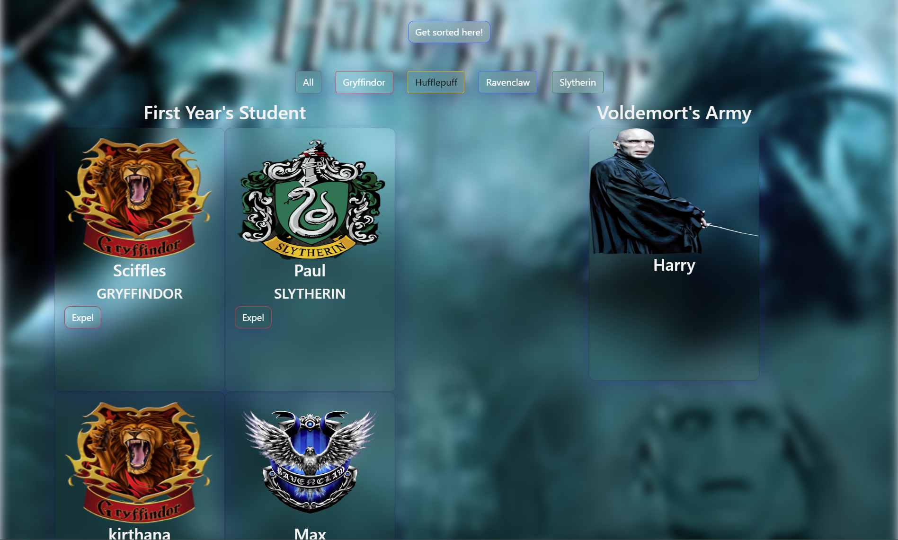

## Sorting Hat ----------

## Overview of the project
Sorting Hat allows users to add New First Year's Students and assign them all with a random houses(group). Which then also provide the users an option to Expel them to the Voldemort's Army if they want to.

## Link/screenshot of data flowchart
None

## Link to Kirthana's wireframes/prototype
No wireframes were used for this project.

## Link to the deployed project

## Link to the project board

## Description of the users
Any user can understand the function of the website and access them without any authentications. 

## List of features
* Simply by clicking a sorting hat button a form pops up asking to fill in the name of the student that has to be added . 
* Adds that new student inside the cards .Also sorts them according to the houses(group) they belong and changes the image of the cards by houses(group).
* It expels the students to the Voldemort's Army and changes the image by just clicking the expel button.

## ScreenShot of the project

## List of contributors and links to their GitHub profiles

## Link to Loom video walkthrough of the app

